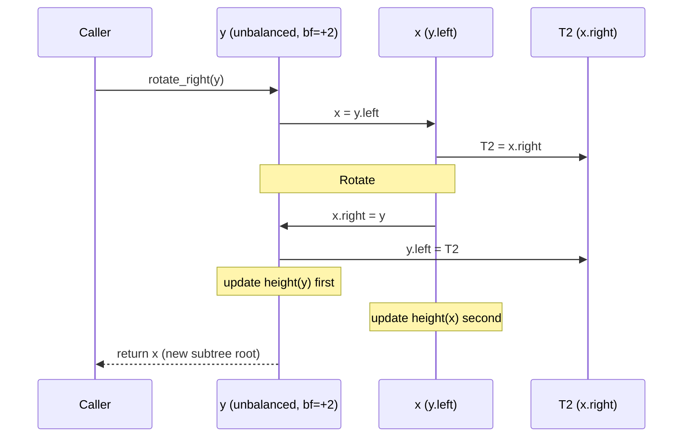

# Laboratory Activity No. 9: Height Balancing in AVL Trees

**Course Code:** CPEPRO8L  **Course Title:** Data Structures and Algorithms
**Term:** First Semester, AY 2026-2027

## Objectives

1. Calculate height metrics and balance factors dynamically.
2. Implement single and double rotations (LL, RR, LR, RL cases).
3. Demonstrate self-balancing tree insertions.

## Files

| File | Description |
|---|---|
| `lab9_avl.py` | `AVLNode` / `AVLTree` with `rotate_right`, `rotate_left`, and `insert` |
| `sample_output.txt` | Full console capture of `python lab9_avl.py` |

## How to Run

```bash
python lab9_avl.py
```

No external libraries are needed (Python 3.8+).

## Implementation Summary

- **Height:** `height = 1 + max(height(left), height(right))`, recomputed on every ancestor after an insert.
- **Balance factor:** `bf = height(left) - height(right)`. A node is balanced if `bf` is in `[-1, 1]`.
- **`rotate_right(y)`:** `y.left` (x) becomes the new root, x's old right subtree becomes y's left, and y becomes x's right child. Heights of `y` then `x` are updated.
- **`rotate_left(x)`:** the mirror image, using `x.right` (y).
- **`insert`:** standard BST insert, update height, compute balance, then pick a case:

| Case | Condition | Fix |
|---|---|---|
| LL | `bf > 1` and `key < left.key` | rotate right on node |
| RR | `bf < -1` and `key > right.key` | rotate left on node |
| LR | `bf > 1` and `key > left.key` | rotate left on left child, then rotate right on node |
| RL | `bf < -1` and `key < right.key` | rotate right on right child, then rotate left on node |

## Execution & Output

Running `python lab9_avl.py` produces five traces (RR, LL, LR, RL, and sorted keys 1-7). The tree is printed sideways (right subtree on top). Each node shows `(h = height, bf = balance factor)`. The full capture is in `sample_output.txt`.

Excerpt, Trace 1 (insert `[10, 20, 30]`):

```text
Insert 10:
└── 10 (h=1, bf=+0)

Insert 20:
│   ┌── 20 (h=1, bf=+0)
└── 10 (h=2, bf=-1)

Insert 30:
  Node 10: balance=-2 -> RR case, rotate left
│   ┌── 30 (h=1, bf=+0)
└── 20 (h=2, bf=+0)
    └── 10 (h=1, bf=+0)

In-order : [10, 20, 30]
Pre-order: [20, 10, 30]
Root height: 2
```

Sorted keys `1..7` would make a plain BST a chain of height 7. With AVL balancing the final height is 3, with root 4 (pre-order `[4, 2, 1, 3, 6, 5, 7]`).

## Report Analysis Questions

### 1. Implement the AVL insertion and rotation routines. Show a sequence diagram of a right rotation.

The routines are in `lab9_avl.py`. A right rotation fixes the **LL case**, where the left subtree of `y` is too tall because of an insertion in `y.left.left`.

**Sequence diagram (steps of `rotate_right(y)`):**



**Structure before and after:**

```text
Before (LL case)               After rotate_right(y)

        y  (bf=+2)                     x  (bf=0)
       / \                           / \
      x   T3                        T1   y
     / \                                / \
   T1   T2                            T2   T3

x.right = y ; y.left = T2   (BST order T1 < x < T2 < y < T3 is preserved)
```

**Concrete example (insert 30, 20, 10):**

```text
   30 (bf=+2)           20
   /             -->   /  \
  20                  10   30
 /
10
```

### 2. Insert keys [10, 20, 30] sequentially and trace the automatic left rotation.

| Step | Insert | Tree (pre-order) | Heights / balance factors | Action |
|---|---|---|---|---|
| 1 | 10 | `10` | 10: h=1, bf=0 | none |
| 2 | 20 | `10 -> 20` (20 is right child) | 10: h=2, bf=-1; 20: h=1, bf=0 | none (bf within [-1, 1]) |
| 3 | 30 | `10 -> 20 -> 30` (right chain) | 10: h=3, bf=-2 (unbalanced) | **RR case -> `rotate_left(10)`** |
| after | | `20` root, `10` left, `30` right | 20: h=2, bf=0; 10 and 30: h=1, bf=0 | balanced |

**Detail of step 3:**

1. After inserting 30, recursion returns upward. Node 30 and node 20 are fine (bf = 0 and -1).
2. At node 10, `height(left)=0` and `height(right)=2`, so `bf = -2`. Since `30 > 20` (`key > root.right.key`), this is the **RR case**.
3. `rotate_left(10)`: `y = 20`, `T2 = y.left = None`, then `20.left = 10` and `10.right = None`.
4. Heights are updated: `10 -> 1`, then `20 -> 2`. Node `20` is returned as the new root.

```text
 10 (bf=-2)                 20 (bf=0)
   \                       /  \
    20          -->      10    30
      \
       30
```

This matches the console output above. The in-order traversal is still `[10, 20, 30]`, and the tree height is 2 instead of 3.
